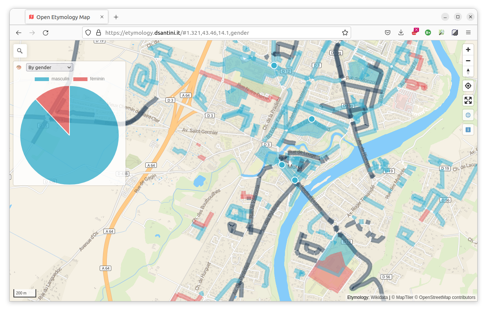
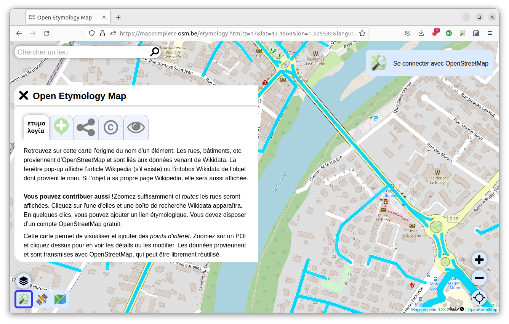
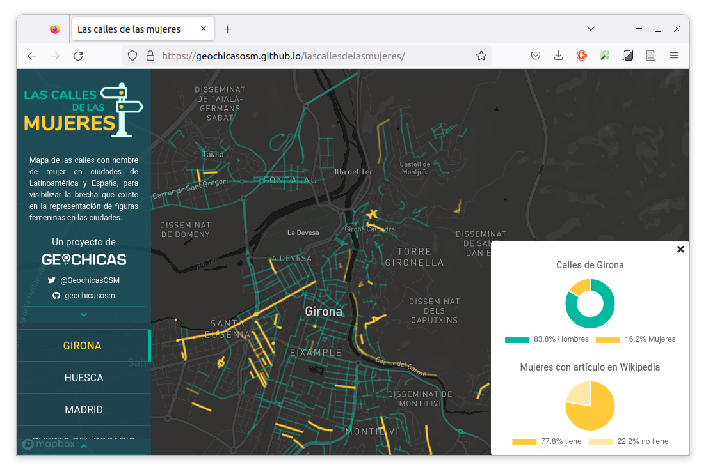

```{r setup, include=FALSE}

## Global options
knitr::opts_chunk$set(echo=TRUE,
        	            cache=FALSE,
                      prompt=FALSE,
                      comment=NA,
                      message=FALSE,
                      warning=FALSE,
                      class.source="bg-info",
                      class.output="bg-warning")


```

> Le résumé de votre fiche dans cet encart

# Introduction {.unnumbered}

Ce document montre comment réaliser une analyse reproductible de la répartition du genre dans les odonymes. Une analyse similaire a été réalisée à partir d'un jeux de données sur les prénoms disponible sur data.gouv.fr [@Gilles14] ainsi qu'une méthodologie s'appuyant sur un rapprochement des données OpenStreetMap avec Wikidata [@Comai21]. Cependant cette méthode ne s'appuie pas sur la clef `name:etymology:wikidata` [@wikiosm:Key:name:etymology:wikidata] qui permet d'identifier clairement l'origine étymologique d'un élément sur OpenStreetMap. Ici nous attendons prouver qu'il est possible de réaliser cette analyse à grande échelle, en générant également des matrices de confiance.

Il existe plusieurs outils qui tirent parti de cette clef `name:etymology:wikidata`

-   <https://etymology.dsantini.it/> dont la méthodologie est décrite [ici](https://gitlab.com/openetymologymap/open-etymology-map/-/blob/main/CONTRIBUTING.md#how-to-contribute-to-the-etymology-data).



-   <https://mapcomplete.osm.be/etymology.html> pour visualiser et contribuer



-   <https://geochicasosm.github.io/lascallesdelasmujeres/> pour visualiser les noms de rues par genre



# Préparation des données

### Packages

Pour réaliser ces analyses, nous nous appuyons sur plusieurs packages:

-   `osmextract` [@osmextract] pour télécharger et traiter les données OpenStreetMap,

-   `tidywikidatar` [@tidywikidatar]

-   `mapsf` [@mapsf]

-   `stringr` [@stringr]

-   `stringi` [@stringi]

-   `ggplot2` [@ggplot2]

```{r get_boundary, eval=FALSE}
library(osmextract)
muret <- oe_get(
  place = "Muret, France",
  download_directory = "data/",
  layer = "multipolygons",
  extra_tags = c("name"),
  vectortranslate_options = c(
    "-t_srs", "EPSG:2154",
    "-nlt", "PROMOTE_TO_MULTI",
    "-where", "type = 'boundary' AND admin_level = '8' AND name = 'Muret'"
  ))
```

```{r eval=FALSE, echo=FALSE}
library(qs)
qsave(muret, "data/temp/muret.qs")
```

```{r eval=TRUE, echo=FALSE}
library(qs)
muret <- qread("data/temp/muret.qs")
```

```{r eval=TRUE, echo=FALSE}
library(mapsf)
mf_map(muret, col = "#6eb1db")
mf_title("Muret", bg = "#6eb1db")
```

```{r get_road, eval=FALSE}
road <- oe_get(
  place = "Muret, France",
  download_directory = "data/",
  layer = "lines",
  extra_tags = c("name", "name:etymology:wikidata"),
  boundary = muret,
  boundary_type = "clipsrc",
  vectortranslate_options = c(
    "-t_srs", "EPSG:2154",
    "-nlt", "PROMOTE_TO_MULTI",
    "-where", "highway IS NOT NULL AND name IS NOT NULL"
  ))[, c("osm_id", "name", "name_etymology_wikidata")]
```

```{r eval=FALSE, echo=FALSE}
qsave(road, "data/temp/road.qs")
```

```{r eval=TRUE, echo=FALSE}
road <- qread("data/temp/road.qs")
```

```{r eval=TRUE}
mf_map(road)
mf_title("Routes avec un nom", bg = "#6eb1db")
```

```{r matcher_wikidata_key, eval=FALSE, echo=TRUE}
library(tidywikidatar)
library(dplyr)
matcher_wikidata_key <- function(road){
  join_gender <- rbind(
  subset(road, is.na(name_etymology_wikidata)) %>%
  mutate(gender = NA),
  subset(road, !is.na(name_etymology_wikidata)) %>%
  mutate(gender = tw_get_property(id = name_etymology_wikidata, p = "P21") %>%
           pull(value) %>%
           tw_get_label())
)
  add_source <- rbind(
    subset(join_gender, !is.na(gender)) %>%
  mutate(prop_source = "wikidata_key"),
subset(join_gender, is.na(gender)) %>%
  mutate(prop_source = NA)
  )
  return(add_source)
}
matcher_wikidata.result <- matcher_wikidata_key(road)
```

```{r eval=FALSE, echo=FALSE}
qsave(matcher_wikidata.result, "data/temp/matcher_wikidata.result.qs")
```

```{r eval=TRUE, echo=FALSE}
matcher_wikidata.result <- qread("data/temp/matcher_wikidata.result.qs")
```

```{r eval=TRUE, echo=TRUE}
mf_map(muret)
mf_map(matcher_wikidata.result,
       var = "gender",
       type = "typo",
       pal = c("#e71010", "#078907"),
       add = TRUE)
mf_title("Genre déduit avec la clef name:etymology:wikidata", bg = "#6eb1db")
```

```{r eval=TRUE, echo=FALSE}
library(dplyr)
```

```{r eval=TRUE, echo=FALSE}
library(sf)
library(ggplot2)
data_pie <- matcher_wikidata.result %>%
  count(gender) %>%
  st_drop_geometry() %>%
  mutate(perc = `n` / sum(`n`)) %>%
  arrange(perc) %>%
  mutate(labels = scales::percent(perc))
```

```{r eval=TRUE, echo=FALSE}
ggplot(data_pie, aes(x="", y=n, fill=gender)) +
  geom_col() +
  geom_label(aes(label = labels),
             position = position_stack(vjust = 0.5),
             show.legend = FALSE) +
  coord_polar(theta = "y") +
  theme_void() +
  scale_fill_manual(values = c("#e71010", "#078907"))
```

```{r name_shortener, eval=TRUE, echo=TRUE}
library(stringr)
library(stringi)
name_shortener <- function(df){
  clean = df %>% mutate(
    short_name = name,
    short_name = short_name %>%
      tolower() %>%
      stri_trans_general("Latin-ASCII")
  )
  prefixe = c("place","rue","boulevard","avenue","chemin","allee","allees","rond-point","rond point","route","impasse","vieux chemin","quai","place")
  mod = c("des","du","de", "d'", "")
  a = as.character()
  for (i in 1:length(mod)){
    b <- paste(prefixe, mod[[i]])
    a = append(a, b)
  }
  return(
    clean %>%
      mutate(short_name = str_remove_all(short_name, str_c(a, collapse = "|") %>% trimws("left")))
  )
}
```

```{r eval=TRUE, echo=FALSE}
library(reactable)
reactable(
  name_shortener(
    subset(matcher_wikidata.result, is.na(prop_source))
  ) %>%
    st_drop_geometry()
)
```

```{r eval=FALSE, echo=FALSE}
ggg <- function(name){
  wikidata_result =name %>%
    tw_search() %>%
    mutate(instance_of = tw_get_property(id = id, p = "P31") %>% pull(value) %>% tw_get_label())
  find_gender = if (any(wikidata_result$instance_of == "human") == TRUE){
    wikidata_result %>%
      filter(instance_of == "human") %>%
      head(1) %>%
      tw_get_property(1, p ="P21") %>% pull(value) %>% tw_get_label()
  } else if(any(wikidata_result$instance_of == "human") == FALSE){
    NA
  }
  return(find_gender)
}
ggg("Simone Veil")
```

```{r search_wikidata_id, eval=TRUE, echo=TRUE}
library(tidywikidatar)
search_wikidata_id <- function(name){
  df = tw_search(name) %>%
    tw_filter_first("P31", "Q5") %>%
    pull(id)
  if (identical(df, character(0))){
     NA
  } else {
    df
  }
}
search_wikidata_id("simone veil")
```

```{r eval=FALSE, echo=FALSE}
search_wikidata_id <- function(name){
  wikidata_result = name %>%
    tw_search() %>%
    mutate(instance_of = tw_get_property(id = id, p = "P31") %>% pull(value) %>% tw_get_label())
  find_gender = if (any(wikidata_result$instance_of == "human") == TRUE){
    wikidata_result %>%
      filter(instance_of == "human") %>%
      head(1) %>%
      pull(id)
  } else if(any(wikidata_result$instance_of == "human") == FALSE){
    NA
  }
  return(find_gender)
}
search_wikidata_id("Simone Veil")
```

```{r}
search_wikidata_id("simone veil") %>%
  tw_get_property(p ="P21") %>% pull(value) %>% tw_get_label()
```

```{r eval=FALSE, echo=FALSE}
name_shortener(
    subset(matcher_wikidata.result, is.na(prop_source))
  ) %>%
  head(10)
```

# Bibliographie {.unnumbered}

::: {#refs}
:::

# Annexes {.unnumbered}

## Info session {.unnumbered}

```{r session_info, echo=FALSE}
kableExtra::kable_styling(knitr::kable(rzine::sessionRzine()[[1]], row.names = F))
kableExtra::kable_styling(knitr::kable(rzine::sessionRzine()[[2]], row.names = F))
```

## Citation {.unnumbered}

```{r Citation, echo=FALSE}
rref <- bibentry(
   bibtype = "misc",
   title = "Titre de la fiche",
   subtitle = "Sous-Titre de la fiche",
   author = c("Premier Auteur.e", "Second Auteur.e"),
   doi = "10.48645/xxxxxx",
   url = "https://rzine.fr/publication_rzine/xxxxxxx/",
   keywords ="FOS: Other social sciences",
   language = "fr",
   publisher = "FR2007 CIST",
   year = 2021,
   copyright = "Creative Commons Attribution Share Alike 4.0 International")

```

`r capture.output(print(rref))`

### BibTex : {.unnumbered}

```{r generateBibTex, echo=FALSE}

writeLines(toBibtex(rref), "cite.bib")
toBibtex(rref)

```

<br/>

## Glossaire {#endnotes .unnumbered}

```{js, echo=FALSE}

$(document).ready(function() {
  $('.footnotes ol').appendTo('#endnotes');
  $('.footnotes').remove();
});

```
